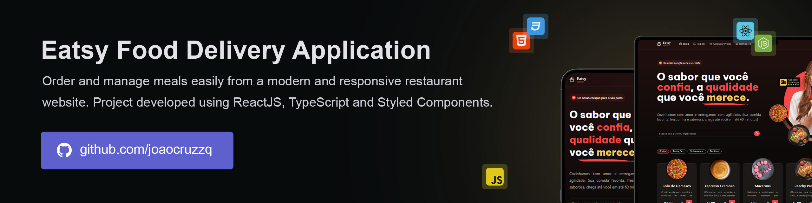

# Eatsy  

Browse dishes, customize your order, and enjoy a seamless food delivery experience through a modern restaurant interface. Built for convenience, Eatsy lets users place orders, choose payment methods, and enter delivery details with ease. With a clean design and responsive layout, managing meals online has never been simpler.

> 🔥 Built with the latest web technologies to ensure fast speed, high performance, and a seamless user experience. It leverages modern tools to deliver a responsive and intuitive interface across devices.



## Running

Follow these steps to run the project locally:

1. Clone the repository:
   ```sh
   git clone https://github.com/joaocruzzq/eatsy.git
   cd eatsy
   ```

2. Install dependencies:
   ```sh
   npm install # Installs the required dependencies
   ```

3. Run the application:
   ```sh
   npm run dev # Starts the development server
   ```

> Note: Make sure you have <a href="https://nodejs.org/pt">Node.js</a> installed before starting.

## Features

> This application **should be able to**:

- fetch and display user profile data from the GitHub API.
- list and filter issues from a GitHub repository as blog posts.
- view the full content of a post on a dedicated page.
- be fully responsive, optimized for both desktop and mobile devices.

## 🛠️ Technologies Used

| **Technology**               | **Description**                                                                 | **Version**  |
|------------------------------|---------------------------------------------------------------------------------|--------------|
| **React**                    | A frontend library for building user interfaces.                                | 18.0.0       |
| **React Router DOM**         | Handles routing and navigation in React apps.                                   | 7.1.5        |
| **React Hook Form**          | Performant, flexible form library for React.                                    | 7.54.2       |
| **Zod**                      | TypeScript-first schema declaration and validation library.                     | 3.24.2       |
| **Axios**                    | Promise-based HTTP client for the browser and Node.js.                          | 1.7.9        |
| **Tailwind CSS**| Utility-first CSS framework for styling.                                                     | 3.4.17       |
| **Radix UI**                 | Primitives for building accessible UI components (dialog, select, etc).         | various*     |
| **Lucide React**             | Beautiful & consistent icon library for React.                                  | 0.475.0      |
| **React Helmet Async**       | Manage document head in async rendering environments.                           | 2.0.5        |
| **Recharts**                 | A composable charting library built on React components.                        | 2.15.1       |
| **Sonner**                   | An opinionated toast library for React.                                         | 1.7.4        |
| **Vite**                     | Lightning-fast frontend build tool.                                             | 6.1.0        |
| **TypeScript**               | A superset of JavaScript that adds static typing.                               | 5.7.2        |
